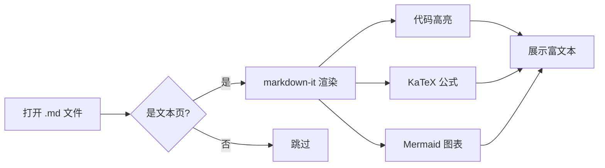
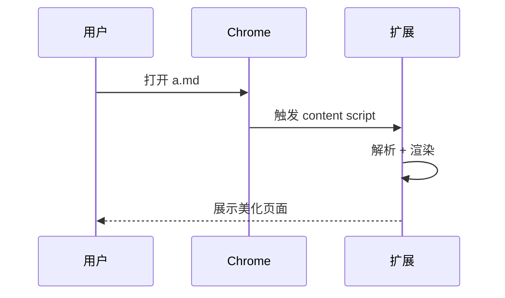

# Markdown Viewer 测试样张

> 这是一个用来验证插件渲染效果的示例文件。可以打开它检查所有功能是否正常工作。

## 基础语法

**粗体** _斜体_ ~~删除线~~ `行内代码` [一个链接](https://example.com)

- 无序列表项 1
- 无序列表项 2
  - 嵌套项
- 无序列表项 3

1. 有序列表
2. 第二项
3. 第三项

### 任务列表

- [x] 自动渲染
- [x] 代码高亮
- [x] Mermaid 图表
- [ ] 等你测试

## 代码块

```javascript
// 一段 JavaScript 代码
function greet(name) {
  console.log(`Hello, ${name}!`);
  return { ok: true, message: `Welcome, ${name}` };
}

greet('Markdown Viewer');
```

```python
# Python 代码
def fib(n: int) -> list[int]:
    a, b = 0, 1
    result = []
    for _ in range(n):
        result.append(a)
        a, b = b, a + b
    return result

print(fib(10))
```

```bash
# Shell 命令
git status
npm install && npm run build
```

## 表格

| 功能 | 状态 | 备注 |
|------|------|------|
| 基础语法 | ✅ | CommonMark + GFM |
| 代码高亮 | ✅ | highlight.js |
| Mermaid | ✅ | 流程图、时序图 |
| KaTeX | ✅ | 数学公式 |
| TOC | ✅ | 自动生成目录 |
| 深色模式 | ✅ | 跟随系统 |

## 引用

> 这是一段引用。
>
> > 嵌套引用也是可以的。
>
> — 某位智者

## 数学公式 (KaTeX)

行内公式：$E = mc^2$ 和 $\sum_{i=1}^{n} x_i = \frac{n(n+1)}{2}$

独立公式：

$$
\int_{-\infty}^{\infty} e^{-x^2} dx = \sqrt{\pi}
$$

$$
\begin{pmatrix}
a & b \\
c & d
\end{pmatrix}
\begin{pmatrix}
x \\
y
\end{pmatrix}
=
\begin{pmatrix}
ax + by \\
cx + dy
\end{pmatrix}
$$

## Mermaid 流程图



## Mermaid 时序图



## 图片


## 分隔线

---

## 长内容（测试 TOC）

### 章节 A

Lorem ipsum dolor sit amet, consectetur adipiscing elit.

### 章节 B

Ut enim ad minim veniam, quis nostrud exercitation.

#### 子章节 B.1

详细内容……

#### 子章节 B.2

详细内容……

### 章节 C

最后一段。

---

**键盘快捷键**

| 键 | 功能 |
|----|------|
| T  | 切换目录 |
| D  | 切换主题 |
| R  | 查看原文 |
| Ctrl+P | 打印 / 导出 PDF |
